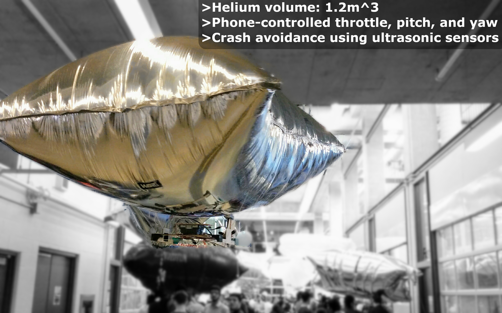

Built as a 1B term project, this helium blimp sucessfully flew. I was primairily involved with the design and construction of the lifting bag. 

The control authority was fairly poor but it was able to make turns and stay aloft for a good amount of time before losing too much helium.

