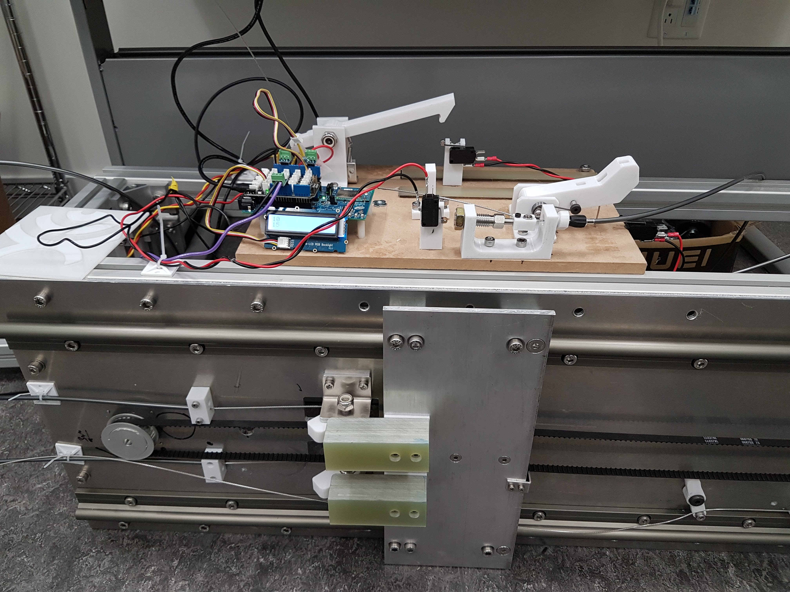

**Automated reliability testing rig**

Designed to repeatedly cycle the mehanical interlocks present on the MR. Run off an Arduino with limit switches to check the function of the systems under test. The linear stage was driven using a clearpath brushless servo.

The setup sucessfully ran over 20,000 cycles and featured error logging and a LCD screen to display error codes.
[Video of the sytem in operation](https://photos.app.goo.gl/ScWVk6wpBpEZcAfZ7)
