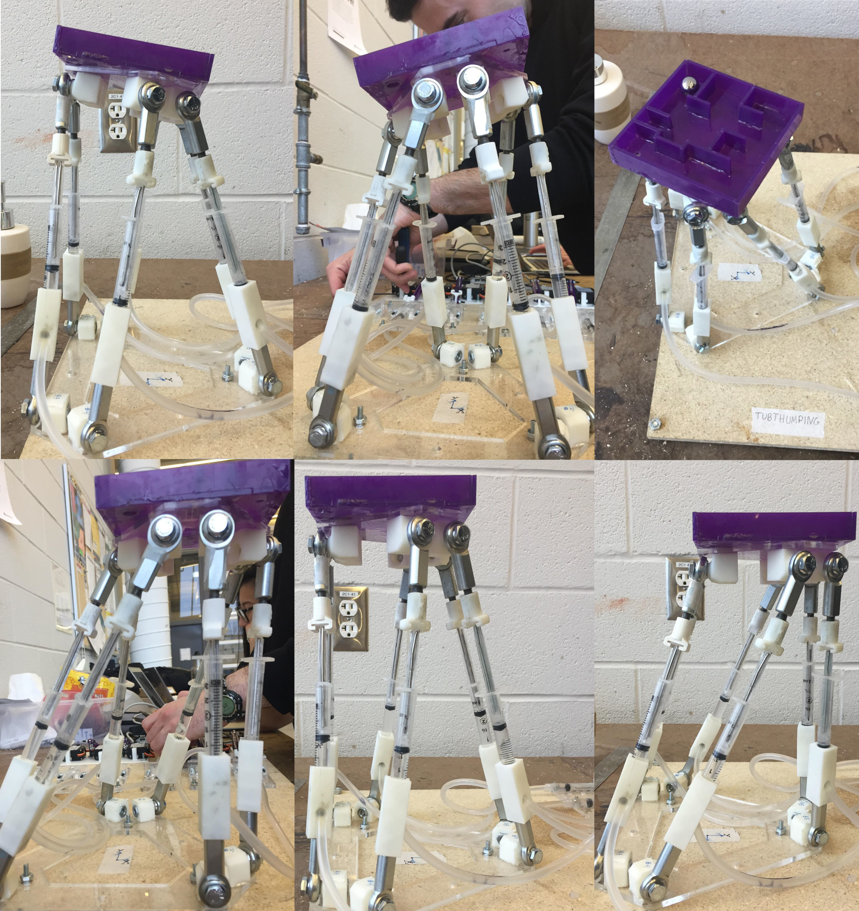
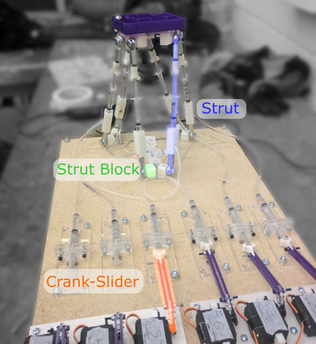

**6DOF Hydraulic Stewart Platform**
Servo-controlled robot which uses 6 pairs of linked syringes to implement a stewart platform. Demonstrated 6 degrees of freedom with notably smoother motion than competing systems due to the hydraulics. The motion controller was able to cusessfully solve a small maze with good repeatability.

