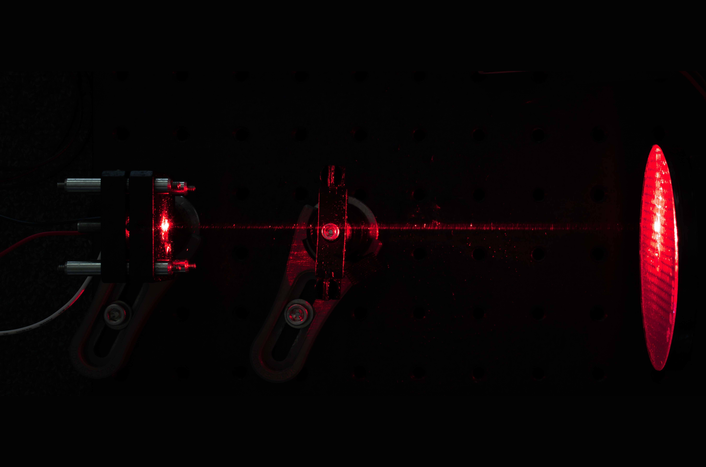

Capstone project which I am currently working on which aims to use the method of [self-mixing interferometry](https://www.researchgate.net/publication/228559944_Laser_diode_self-mixing_technique_for_sensing_applications) to make sub-micron measurments with ~$100 dollars in equipment. I am working on a team to develop the optics and hardware required to turn this research topic into a commercial system.  

<h2>Signal has been acquired with the first prototype!</h2>

We have a setup that is capable of producing a signal when fixtured to an optical bench and in controlled conditions. I was responsible for selecting all the optical components to collimate and control the laser beam as well as desiging a low-noise laser driver circuit.

The next step is to start calibration for thermal and pressure variations in the environment using a precision piezo stage as our "ground truth" reference.

Applications for this technology include:
1. Precision Motion Control
2. Vibration Measurement
3. Surface Roughness Measurment
4. Profilometry
5. Non-contact Velocimetry
6. [Medical applications](https://www.ncbi.nlm.nih.gov/pmc/articles/PMC4883385/) such as vibrocardiography

Glamor shots of the half-built prototype.

At the start of the project a proof of concept was required to ensure that we were able to see signal at all. So one was hasitly constructed using a scope and a simple linear stage with a retroreflector.

Simulation in Zemax showing the collimation performance for the selected lens.

