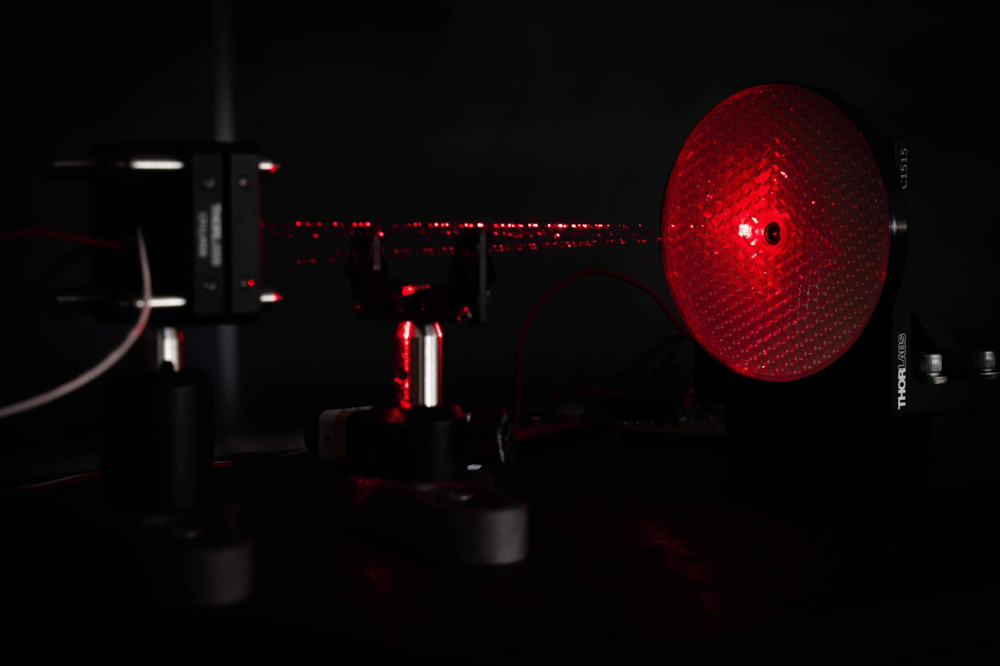

4th year capstone project which was completed in March 2020. Our team achieved an implementation of [self-mixing interferometry](https://www.researchgate.net/publication/228559944_Laser_diode_self-mixing_technique_for_sensing_applications) which was able to make **sub-micron measurments with ~$200 dollars in off-the shelf components**. My tasks consisted of optic design and component selection as well as the majority of the prototyping efforts. Our aim was to develop this into a commercial system and we won the award for best overall technical quality for our design.

+ 
+ 
+ 
+ 

<h2>Signal has been acquired with the first prototype!</h2>

We have a setup that is capable of producing a signal with a resolution in excess of **50nm!** I was responsible for selecting all the optical components to collimate and control the laser beam as well as desiging a low-noise laser driver circuit.

The mechanism of operation relates to mode-hpping within the compound cavity formed by the external retroreflector which imparts a frequency and amplitude modulation inside the diode.

We have started calibration for thermal and pressure variations in the environment using a precision piezo stage as our "ground truth" reference.

Applications for this technology include:
1. Precision Motion Control
2. Vibration Measurement
3. Surface Roughness Measurment
4. Profilometry
5. Non-contact Velocimetry
6. [Medical applications](https://www.ncbi.nlm.nih.gov/pmc/articles/PMC4883385/) such as vibrocardiography

At the start of the project a proof of concept was required to ensure that we were able to see signal at all. So one was hasitly constructed using a scope and a simple linear stage with a retroreflector.

Simulation in Zemax showing the collimation performance for the selected lens.

