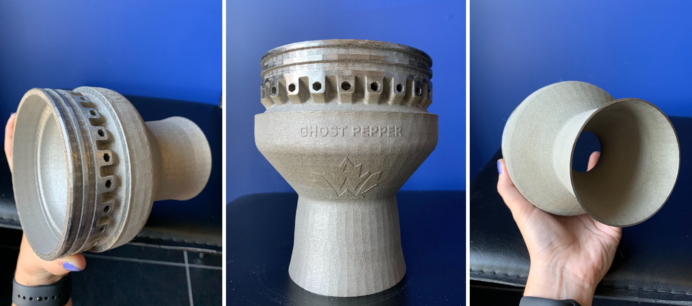
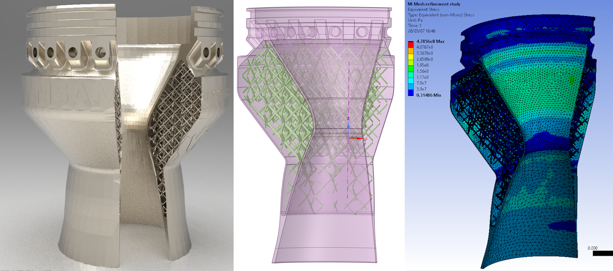
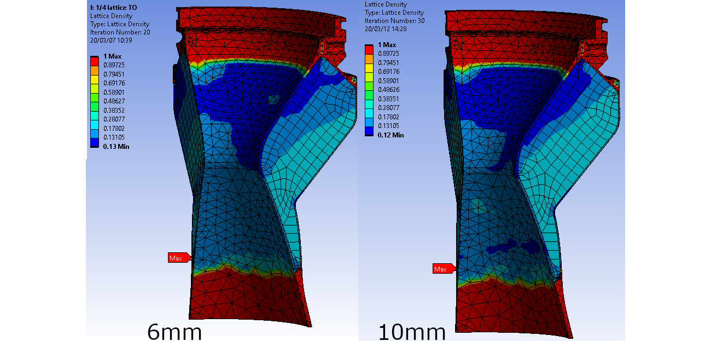
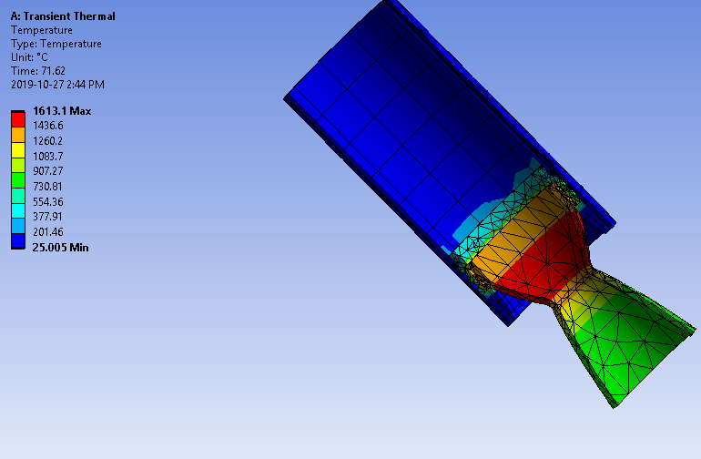
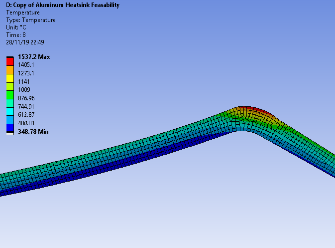
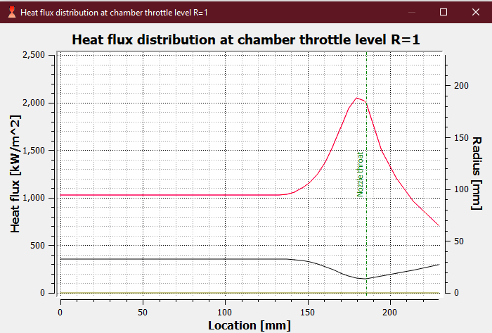

# 3D-Printed Rocket Nozzle
Design for a convergent-diverget nozzle using thrust optimized profile (TOP) bell geometry. Designed to be a drop-in replacement on our current generation hybrid rocket to drastically reduce weight and maintenance required on the nozzle. The nozzle was printed on a Renishaw AM400 machine out of **IN625**, an alloy we selected for its exceptional strength and oxidation resistance at high temperatures. [Here is](../assets/ME739_Report.pdf) a full report on the nozzle design effort.

Most of the work I've been doing is in simulation using transient thermal studies in ANSYS as well as comustion products modelling in Rocket Propulsion Analysis (RPA). Based on efficiency studies, the nozzle will be designed to hit a 4.2 area ratio of expansion and a chamber pressure of 450psig at an oxidizer/fuel ratio of 4.7.
Transient thermal simulation was done in ANSYS using convection properties of the engine exhaust gases to confirm the maximum temperature is within the limits of the materials used. 
+ 
+ 
+ 

After considering various options for thermal control mechanisms (ablative nozzle liners, ceramic throat inserts, active nozzle cooling or heat sinks) a phase-change cooling method was selected. This will use the high vaporization enthalpy of water to draw heat away from the interior of the nozzle. The flame temperature of our combustion is a cool **3000K** which makes this a very interesting problem. To accomodate this and leverage the advantages of SLM printing there will be a coolant channel inside the nozzle. In order to minimize the weight of the nozzle, Ansys was used to apply a lattice topology optimization to the internal structure. This has the benefit of increasing strength precisely where loads are the highest and providing a near-optimal solution to the combined thermal-structural problem.

