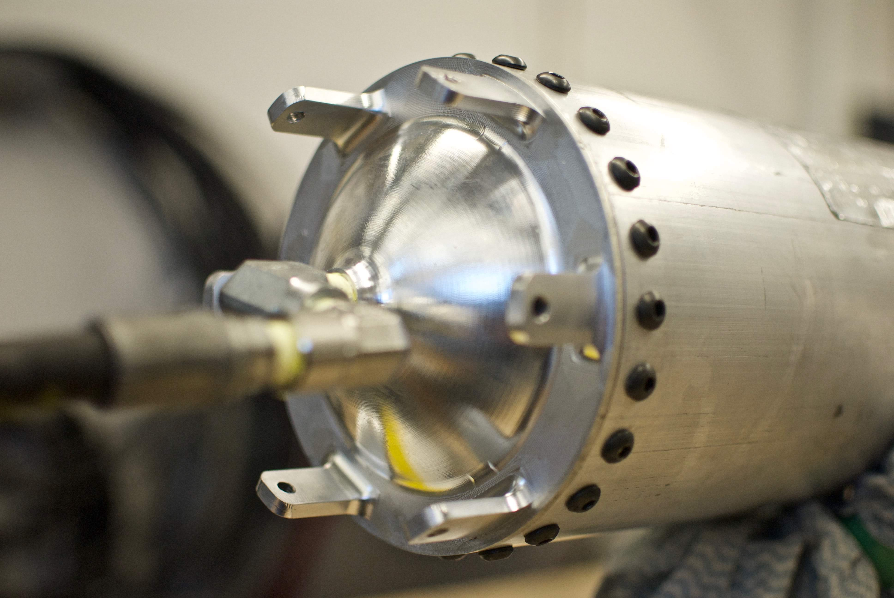
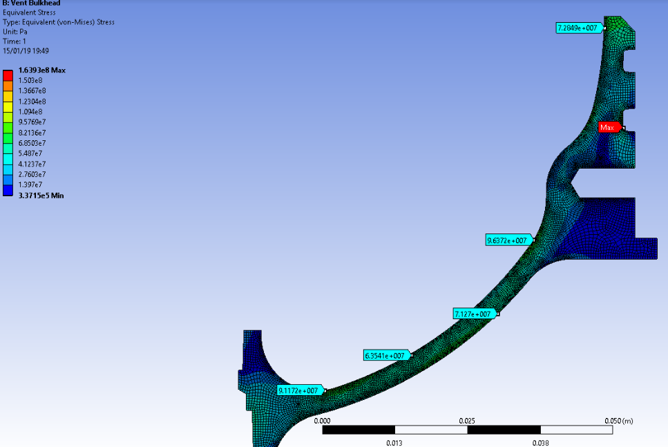

# Weight-optimized nitrous oxide tank
6ft long tank designed to hold nitrous oxide at 1000psi. Designed for easy dissassembly with bolted bulkheads that were CNC machined to have a hemispherical wall.

The bulkhead geometry was analyzed using ANSYS to ensure a saftey factor of 2 as mandated by IREC requirements.
